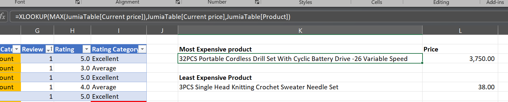
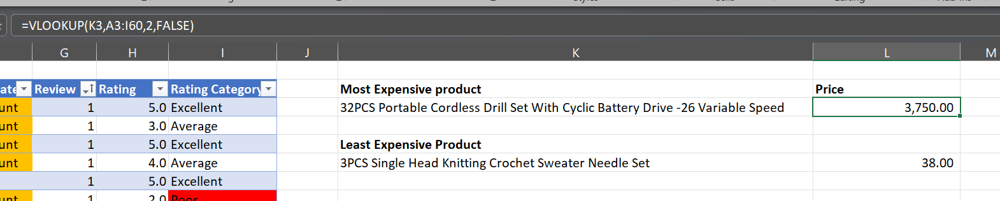

# Jumia Sales Data Analysis

I dived into a sales dataset for an online commercial company to try and understand how customer reviews, rating and product discount affect sales performance. And in this project, I used Excel as an analytical tool.

## Key features I used in this tool:

-Conditional fomatiing 

-XLOOKUP & VLOOKUP functionality

-Pivot Tables & Pivot charts

-Slicers & Filters

-3 paged Dashboard

## Data Dictionary 

Product – Name of the product

Current Price – Current selling price in Kenyan Shillings (KSh)

Old Price – Original price before discount in Kenyan Shillings (KSh)

Discount – Discount percentage applied to the product

Rating – Average customer rating out of 5

## Data Cleaning and Preparation
- I created a copy of the provided sales dataset to maintaing the original dataset and work on my own data named "Data Excel_Jumia".

- I tuned the dataset into a table by pressing **CTRL + T**. After which I went removed duplicate data under the Data Tab-I pickked the product column.

- Checked for and handle missing values, especially in the Reviews and Rating columns

- Identified and removed duplicate product entries

- Converted price columns into numeric format by removing “KSh” by using find and replace **(control +H)**

- Ensured the Discount column is numeric and properly formatted as a percentage

- Converted the Rating column from text format (e.g. “4.5 out of 5”) into numeric values

- Converted negative reviews to positive

## Data Enrichment
I created the following additional columns:

-Discount Amount (KSh): Old Price minus Current Price

-Rating Category:
- Poor for ratings below 3

- Average for ratings between 3 and 4.4

- Excellent for ratings of 4.5 and above

-Discount Category:
- Low Discount for discounts below 20%
- Medium Discount for discounts between 20% and 40%
- High Discount for discounts above 40%


## Conditional fomatting
The below picture show a conditional formatting I applied on all products that had high discounts and the products with poor rating. 


## XLOOKUP & VLOOKUP Functionality
To look up for the product with the highest price I used the XLOOKUP Function as shown below:

```
=XLOOKUP(MAX(JumiaTable[Current price]),JumiaTable[Current price],JumiaTable[Product])

```



And to find the corresponding product price, I used the VLOOKUP Function as shown below:

```
=VLOOKUP(K3,A3:I60,2,FALSE)
```



## Dashboard Design
I used pivot tables as my source to create the Jumia Sales Dahshboard.

Below is an snipset of the pivot tables in a separet sheet. 


From these pivot tables, I created a 4 paged Dashboard that coveres the following questions. 

-Key Performace Indicators

- Total number of products

- Average rating

- Average discount percentage

- Total number of reviews

- Average Old price

- Average Current price

-Product Performance

- Top 10 products by rating

- Top 10 products by number of reviews

- Top 10 products by discount percentage


-Trend Analysis

- Visualizations showing discount percentage versus reviews

- Visualizations showing rating versus reviews

- Top 5 Highest Rated Products

- Bottom 5 Lowest Rated Products


-Product Categories

- Breakdown of products by rating category **-Using Slicer**


- Breakdown of products by discount category **-Using Filter**


From the Analysis, It is clear that:

1. Products with Higher discounts receive high reviews from customers
2. Rating on products also have a direct influence on the number of reviews it receive. As shown, Excellent Rating, which is 4 and above out of 5 receive more reviews. 

## Recommendation
Capitalize on creating stratetegic discounts to drive more sales and encourage good client relationship to increase positive reviews on products. 


## Final Remark
This project forced me to figure out how to clean data, use Excel Text Functions, pivot tables, and, incorpotrating Power Point Skills to create a wireframe for my Excel Dashboard. 

[Open Excel Sheet](https://github.com/iganabrian/Excel-Jumia-Sales-Analysis/blob/main/Data%20Excel_jumia.xlsx)


